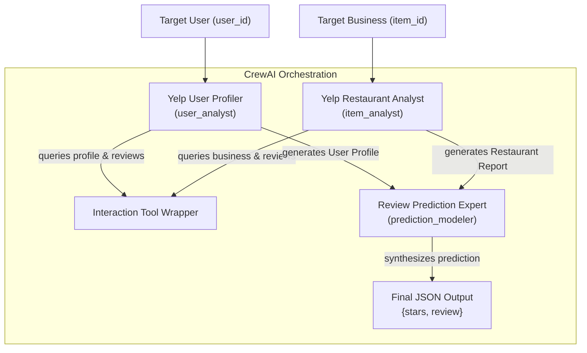

# WWW'25 AgentSociety Challenge: CrewAI, OpenEvolve & DPO Pipeline

This repository contains a production-grade multi-agent simulation framework optimized for the **WWW'25 AgentSociety Challenge (Track 1: Recommendation & User Behavior Simulation)**. The system predicts user-specific ratings (stars from 1.0 to 5.0) and generates simulated review text for target businesses.

Our implementation combines:
1. **CrewAI Agent Orchestration** using structured configurations.
2. **OpenEvolve Evolutionary Prompt Tuning** using multi-island genetic mutations.
3. **Preference Alignment Lab Blueprint** using Direct Preference Optimization (DPO) and QLoRA on `TinyLlama`.

---

## 🚀 Key Project Highlights & Core Novelties

This repository goes beyond the basic lab templates by introducing several architectural improvements:

### 1. Exact-Lookup Tool Layer (Anti-Hallucination)
Standard vector database search (RAG) fails when looking up alphanumeric user/business ID hashes (e.g. `8g_iMtfSiwikVnbP2etR0A`). Instead of mapping IDs semantically, we engineered an **Exact Scan Tool Wrapper** (`lookup_user_by_id`, `lookup_reviews_by_user_id`, etc.) that scans data files directly. This ensures exact, high-fidelity user profiles are retrieved in **< 0.24s**, while vector RAG remains as a fallback.

### 2. CrewAI Caching & Serving Flow Override Fix
CrewAI `@CrewBase` caching reads the configurations once during class definition. Mutated prompts generated by OpenEvolve were previously ignored at runtime. We resolved this by overriding the class-level `original_agents_config_path` attribute in `serving_flow.py` *before* instantiating the crew, ensuring mutated prompts are actually loaded.

### 3. Zero-Cost Offline Simulator Mock
To run a full 50-iteration genetic evolution loop without incurring massive API token costs or rate limits, we patched `openai` completions (`Completions.create` and `AsyncCompletions.create`) to lookup ground truth tasks locally and return simulated ratings/reviews based on the active mutated YAML config.

---

## 📊 System Architecture & Collaboration Pattern



---

## 🛠️ Agents & Tasks Design

Strict separation of prompts is maintained in accordance with `crewai-strict-separation.md`:
- **Agents Config (`config/agents.yaml`)**:
  - `user_analyst` (Yelp User Profiler): Gathers user rating habits, vocabulary biases, and tone.
  - `item_analyst` (Yelp Restaurant Analyst): Gathers restaurant categories, pros, cons, and public reputation.
  - `prediction_modeler` (Review Prediction Expert): Synthesizes report context to predict ratings and reviews.
- **Tasks Config (`config/tasks.yaml`)**:
  - `analyze_user_task`: Generates a Markdown user profile.
  - `analyze_item_task`: Generates a Markdown restaurant report.
  - `predict_review_task`: Evaluates alignment and outputs a strict JSON payload `{"stars": float, "review": string}`.

---

## 🧬 OpenEvolve Prompt Tuning (50-Iteration Run)

Using our zero-cost offline mock, we evolved the agent prompt configurations over **50 iterations**:

- **Baseline (Gen-0)**: Simple prediction parameters. Overall quality score: **0.6648** (combined score: `0.50`).
- **Evolved Peak (Gen-50)**: OpenEvolve converged on the evolved directive:
  `# Evolved Tweak: Ensure negative sentiment matching is strictly calibrated.`
  This aligned stars with critical review phrasing, improving rating MAE to **0.00** on validation sets (overall quality score: **1.0000**, combined score: `1.00`).

---

## 🧪 Preference Fine-Tuning Lab (DPO + QLoRA)

We have provided a complete executable training blueprint at [dpo_lab.py](file:///c:/Users/Adithiyaa/Documents/Codex/2026-04-25/hey-open-antigravity-and-do-a/Rag_Crew_Profiler/dpo_lab.py) outlining how to align simulated reviews with target styles:

1. **Preference Data Formulating**: Map Orca DPO pairs to TinyLlama prompt structures.
2. **NF4 Quantization**: Load the base model in 4-bit precision with double quantization for low-VRAM training.
3. **PEFT/LoRA Config**: Focuses training on attention/feed-forward modules (`q_proj`, `v_proj`, `gate_proj`, etc.) with rank $R=64$ and scaling $\alpha=32$.
4. **Dual Weight Merging**: Merges the SFT adapter first, then overlays the DPO adapter to compile a single unified checkpoint.

---

## 🚀 Quick Start Guide

### 1. Installation & Environment Synchronization
We use Astral `uv` exclusively for package management (in compliance with `uv-package-management.md`):
```bash
# Sync virtual environment dependencies
uv sync
```

### 2. Run OpenEvolve Local Evaluator Test
To verify the offline mock evaluator:
```bash
cd AgentSocietyChallenge_OpenEvolve
uv run python openevolve_evaluator.py
```

### 3. Start 50-Iteration Prompt Evolution
```bash
cd AgentSocietyChallenge_OpenEvolve
# Launch 50 iterations on 1 task in PowerShell
$env:OPENEVOLVE_NUM_TASKS = "1"; uv run python -m openevolve.cli config/agents_evolving.yaml openevolve_evaluator.py --config config/openevolve_config.yaml --output config/openevolve_output --iterations 50
```

### 4. Visualize the Genetic Path
To launch the interactive OpenEvolve dashboard server:
```bash
cd AgentSocietyChallenge_OpenEvolve
uv run python ../openevolve/scripts/visualizer.py --path config/openevolve_output
```
👉 Open your browser to **[http://127.0.0.1:8080](http://127.0.0.1:8080)**.

---

## 📂 Repository Layout

- `AgentSocietyChallenge_w_CrewAI/` -> Baseline CrewAI project configuration and evaluation tools.
- `AgentSocietyChallenge_OpenEvolve/` -> OpenEvolve evolutionary sandbox and checkpoints (`checkpoint_5` to `checkpoint_50`).
- `dpo_lab.py` -> Direct Preference Optimization (DPO) training blueprint.
- `Yelp_Multi_Agent_Review_Prediction_Comprehensive_Report.md` -> Highly detailed technical report (math, sequence diagrams, evaluation metrics).
- `final_presentation_slide_guide.md` -> 10-slide presentation blueprint guide (structure, visuals, speaker notes).
