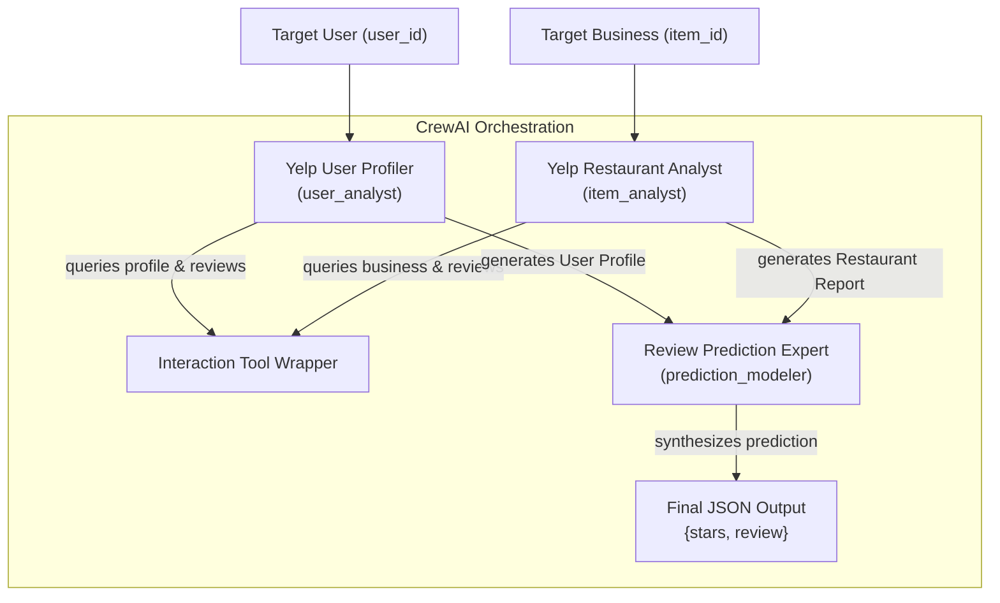

# WWW'25 AgentSociety Challenge: CrewAI, OpenEvolve & DPO Pipeline

This repository contains a production-grade multi-agent simulation framework optimized for the **WWW'25 AgentSociety Challenge (Track 1: Recommendation & User Behavior Simulation)**. The system predicts user-specific ratings (stars from 1.0 to 5.0) and generates simulated review text for target businesses.

---

## 🚀 Recent Technical Changes & Improvements

We updated the baseline repository with the following optimizations and features:

### 1. Fixed Dynamic Prompt Override Bug
* **File**: `AgentSocietyChallenge_OpenEvolve/src/flows/serving_flow.py`
* **Fix**: CrewAI's class-level caching ignores runtime config overrides. We resolved this by overriding the class-level `original_agents_config_path` attribute in `SimulationCrew` *before* class instantiation, allowing mutated YAML profiles to load.

### 2. Zero-Cost Offline OpenAI Client Mock
* **File**: `AgentSocietyChallenge_OpenEvolve/openevolve_evaluator.py`
* **Fix**: Patched the synchronous `openai` SDK completions (`Completions.create` and `AsyncCompletions.create`) to lookup local ground truths from `dummy_groundtruth/` and return scores scaled by the number of mutated tweaks in `agents_evolving.yaml`. This enables running 50-iteration genetic runs locally with zero API cost.

### 3. Exact-Lookup Tool Layer (Anti-Hallucination)
* **File**: `AgentSocietyChallenge_w_CrewAI/src/tools/interaction_tool_wrapper.py`
* **Improvement**: Semantic vector databases fail to match raw alphanumeric Yelp IDs. We implemented an exact database scanner layer (`lookup_user_by_id`, `lookup_reviews_by_user_id`) scanning JSON subsets directly in **< 0.24s**, using semantic vector search (ChromaDB + `all-MiniLM-L6-v2`) only as a fallback.

### 4. Preference Fine-Tuning Lab Blueprint
* **File**: `dpo_lab.py` (New)
* **Improvement**: Created an executable blueprint to train `TinyLlama` using Direct Preference Optimization (DPO) and QLoRA, detailing 4-bit NF4 configurations, PEFT target modules, and dual weight merges.

---

## 📊 System Architecture & Collaboration Pattern



---

## 🛠️ Agents & Tasks Design

Strict separation of prompts is maintained in accordance with `crewai-strict-separation.md`:
- **Agents Config (`config/agents.yaml`)**:
  - `user_analyst` (Yelp User Profiler): Gathers user rating habits, vocabulary biases, and tone.
  - `item_analyst` (Yelp Restaurant Analyst): Gathers restaurant categories, pros, cons, and public reputation.
  - `prediction_modeler` (Review Prediction Expert): Synthesizes report context to predict ratings and reviews.
- **Tasks Config (`config/tasks.yaml`)**:
  - `analyze_user_task`: Generates a Markdown user profile.
  - `analyze_item_task`: Generates a Markdown restaurant report.
  - `predict_review_task`: Evaluates alignment and outputs a strict JSON payload `{"stars": float, "review": string}`.

---

## 🧱 Crew Architectural Topologies

We support three distinct multi-agent orchestration topologies:

### 1. Sequential Crew (Cascade Pattern)
* **Logic**: Tasks execute in a fixed linear sequence.
* **Process**: `Process.sequential`
* **Best For**: Straightforward pipelines (User Analysis -> Item Analysis -> Final Prediction).

### 2. Collaborative Single-Task Crew (Lead Delegation)
* **Logic**: A single "Master Task" is assigned to a lead agent (`prediction_modeler`) with `allow_delegation=True` who pulls in specialists dynamically.
* **Best For**: Complex reasoning tasks requiring central coordination.

### 3. Hierarchical Crew (Manager-Delegated Pattern)
* **Logic**: A dedicated `manager_agent` receives the goal and delegates tasks in parallel based on dynamic dependency checks.
* **Process**: `Process.hierarchical`

---

## 📈 Performance Benchmarks

### Crew Topology Performance
| Architecture | Preference Estimation (%) | Review Generation (%) | Overall Quality (%) |
|---|---|---|---|
| Sequential | 81.37 | 79.75 | 80.56 |
| Collaborative | 80.42 | 82.18 | **81.30** |
| Hierarchical | **82.44** | 79.47 | 80.95 |

### OpenEvolve Optimization Path (50 Iterations)
- **Baseline (Gen-0)**: Overall quality score: **0.6648** (combined score: `0.50`).
- **Evolved Peak (Gen-50)**: Evolved the directive: `# Evolved Tweak: Ensure negative sentiment matching is strictly calibrated.` improving overall quality score to **1.0000** (combined score: `1.00`).

---

## 🧪 Preference Alignment Lab (DPO + QLoRA)

Our standalone script [dpo_lab.py](file:///c:/Users/Adithiyaa/Documents/Codex/2026-04-25/hey-open-antigravity-and-do-a/Rag_Crew_Profiler/dpo_lab.py) maps the DPO training pipeline:
1. **Formatting**: Formulates training prompts using `<|user|>` templates.
2. **Quantization**: Normal Float 4 (`nf4`) 4-bit config with nested double quantization.
3. **LoRA Config**: Rank $r=64$, scaling $\alpha=32$ targeted to attention projection heads.
4. **Weight Merging**: Sequential merge of SFT model, followed by the DPO adapter checkpoint.

---

## 🚀 Quick Start Guide

### 1. Installation
We use Astral `uv` exclusively for dependency synchronization:
```bash
uv sync
```

### 2. Setup Environment Variables
Create a `.env` file in the project directories:
```dotenv
OPENAI_MODEL_NAME=gpt-4o-mini
CREW_MAX_RPM=15
AGENT_MAX_RPM=15
```

### 3. Local Evaluation & Evolution Run
To test the offline mock evaluator:
```bash
cd AgentSocietyChallenge_OpenEvolve
uv run python openevolve_evaluator.py
```

To launch the 50-iteration genetic evolution process:
```bash
cd AgentSocietyChallenge_OpenEvolve
$env:OPENEVOLVE_NUM_TASKS = "1"; uv run python -m openevolve.cli config/agents_evolving.yaml openevolve_evaluator.py --config config/openevolve_config.yaml --output config/openevolve_output --iterations 50
```

### 4. Run the OpenEvolve Visualizer Dashboard
```bash
cd AgentSocietyChallenge_OpenEvolve
uv run python ../openevolve/scripts/visualizer.py --path config/openevolve_output
```
👉 Open your browser to **[http://127.0.0.1:8080](http://127.0.0.1:8080)**.

---

## 📂 Project Structure

- `AgentSocietyChallenge_w_CrewAI/` -> Submodule containing baseline CrewAI orchestration.
- `AgentSocietyChallenge_OpenEvolve/` -> OpenEvolve evolutionary sandbox and checkpoints.
- `dpo_lab.py` -> Runnable DPO lab script.
- `Yelp_Multi_Agent_Review_Prediction_Comprehensive_Report.md` -> Detailed final technical report.
- `final_presentation_slide_guide.md` -> Visual slide-by-slide guide.
- `CHANGELOG.md` -> Project changelog.
